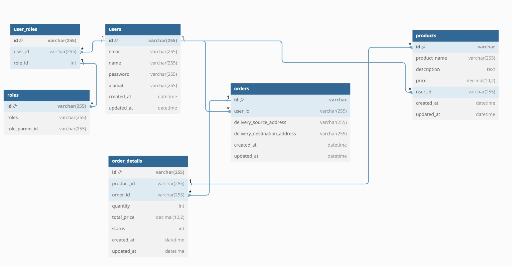

### RESTful API for ecommerce application


## Framework & Library

- GorillaMux (HTTP Framework) : https://pkg.go.dev/github.com/gorilla/mux
- Viper (Configuration) : https://github.com/spf13/viper
- Golang Migrate (Database Migration) : https://github.com/golang-migrate/migrate
- Logrus (Logger) : https://github.com/sirupsen/logrus

## Database Migration
All database migration is in `db/migrations` folder.

## Configuration
All configuration is in `config.json` file.

## instructions On How To Create The Data Are in The Route File
All route is in `internal/route/route.go`

## Download Dependency
```shell
go mod download
go mod tidy
```

### Run Application
```shell
go run main.go
```

### Create Migrations
```shell
migrate create -ext sql -dir db/migrations {table_name}
```


### Database Migration
migration up
```shell
migrate -database "{driver}://{username}:{password}@tcp({host}:{port})/{database_name}" -path db/migrations up

```

migration down
```shell
migrate -database "{driver}://{username}:{password}@tcp({host}:{port})/{database_name}" -path db/migrations down
```

### Postman Collection
[Go-Komodo.postman_collection.json](Go-Komodo.postman_collection.json)

## Design Database


1. Create users as buyers and sellers using SQL script
2. for passwords stored in the database, the password hash
3. if you want to use a hash, use this hash ($2a$10$Vcoyl0C4xDOfMbGgkMB7su47dw9rQPKcB7Do2mgv6F0NwHHPhSQJi) result compare (Asjfjsdfmn123_), you can also do your own hash
4. create data access role (1 = buyer, 2 = seller) 